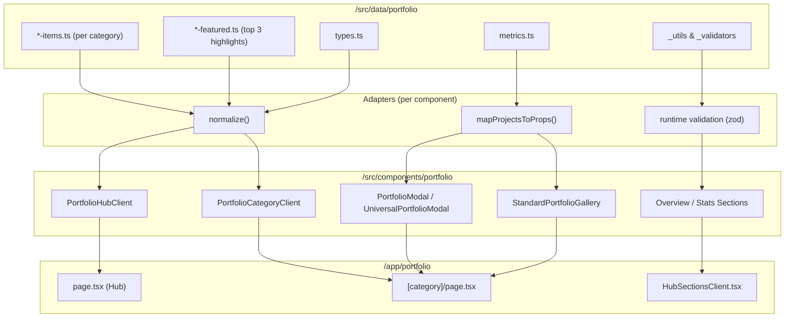

Official Title
Using the Portfolio Module with App Router and Data Domain
Domain
Portfolio, Components, Data, App Router
File Name
portfolio-module-bridge-document_ProductionGuide_2025-09-13.md
Main Part
portfolio-module-bridge-document
Qualifier
ProductionGuide
Date
2025-09-13
Spotlight Comments

This document serves as a bridge to integrate the portfolio module with the App Router and Data domain.
Includes a Mermaid diagram for visual clarity on data flow.
Cross-references /src/data/portfolio, /src/components/portfolio, and /app/portfolio.

Summary
This document provides a comprehensive guide on integrating the portfolio module (/src/components/portfolio) with the App Router (/app/portfolio) and the Data domain (/src/data/portfolio). It outlines the structure and interaction between these layers, emphasizing a thin App Router, a canonical Data layer, and reusable, type-safe Components. Key rules include fetching data only from the Data domain, using adapters for data normalization, and maintaining type safety with TypeScript and Zod validation. The included Mermaid diagram visually maps the flow from data to components via adapters, ensuring clarity for developers onboarding to the project.

---

portfolio-module-bridge-document-09-13-2025.md

---

Perfect — thanks for giving me both directory trees.
What you’re asking for is essentially a **bridge document**: “How does the portfolio module (`/src/components/portfolio`) integrate with the App Router (`/app/portfolio`) and the Data domain (`/src/data/portfolio`) so everything works seamlessly?”

Here’s the **production-ready guide**:

---

# 📘 Using the Portfolio Module with App Router + Data Domain

This document explains **how the portfolio module integrates** with:

1. **App Router pages** (`/app/portfolio`)
2. **Data domain** (`/src/data/portfolio`)

The goal: **keep the App layer thin**, **the Data layer canonical**, and **the Components layer reusable + type-safe.**

---

## 🔑 Mental Model

* **Data (`/src/data/portfolio`)**
  Canonical source of truth.
  Each service/category defines its own `*-items.ts` + `*-featured.ts`.

* **Components (`/src/components/portfolio`)**
  Shared UI system (Hub, Category, Modals, Galleries).
  All data goes through **adapters** before reaching these components.

* **App Router (`/app/portfolio`)**
  Thin routing + orchestration.
  Imports data → runs through adapters → passes props into portfolio components.

---

## 1️⃣ Data Domain (`/src/data/portfolio`)

### Structure

* **`items/`** → individual project files.
* **`[category]-items.ts`** → array of `Project`s for each category.
* **`[category]-featured.ts`** → top 3 “highlight” projects per category.
* **`metrics.ts`** → common KPI metrics.
* **`types.ts`** → canonical `Project`, `CategorySlug`, etc.
* **`_utils/` + `_validators/`** → normalization + runtime validation.

✅ **Rule:** Always fetch data here. Do **not** import raw JSON into App Router or components.

---

## 2️⃣ Components Layer (`/src/components/portfolio`)

Key components:

* **`PortfolioHubClient`**
  Used on `/app/portfolio/page.tsx`.
  Orchestrates **global search + category highlights**.

* **`PortfolioCategoryClient`**
  Used on `/app/portfolio/[category]/page.tsx`.
  Handles per-category filtering, search, and modal rendering.

* **`PortfolioModal` / `UniversalPortfolioModal`**
  Project detail modals. Use **Universal** if working with mixed data.

* **`StandardPortfolioGallery`**
  Grid display for items.

* **`Overview` + `Stats` sections**
  Drop-in blocks for marketing/service pages.

✅ **Rule:** Never import raw data here. Always go through **adapters.ts** provided in each submodule.

---

## 3️⃣ App Router (`/app/portfolio`)

### `/app/portfolio/page.tsx` (Hub Page)

* Imports **all projects** + **per-category featured arrays** from data.
* Adapts them → passes into `PortfolioHubClient`.

```tsx
// app/portfolio/page.tsx
import { PortfolioHubClient } from "@/components/portfolio";
import { getAllProjects, getCategoryHighlights } from "@/src/data/portfolio";

export default function PortfolioHubPage() {
  const allItems = getAllProjects();
  const categoryHighlights = getCategoryHighlights();

  return (
    <PortfolioHubClient
      allItems={allItems}
      categoryHighlights={categoryHighlights}
    />
  );
}
```

---

### `/app/portfolio/[category]/page.tsx` (Category Page)

* Imports **category-specific items**.
* Adapts them → passes into `PortfolioCategoryClient`.

```tsx
// app/portfolio/[category]/page.tsx
import { PortfolioCategoryClient } from "@/components/portfolio";
import { getItemsByCategory } from "@/src/data/portfolio";

export default function CategoryPage({ params }) {
  const items = getItemsByCategory(params.category);

  return (
    <PortfolioCategoryClient
      items={items}
      category={params.category}
    />
  );
}
```

---

### `/app/portfolio/HubSectionsClient.tsx`

* Example: can orchestrate multiple subcomponents (Overview, Stats, Galleries).
* Pulls in from **data layer** → passes into section adapters → renders.

---

## 4️⃣ Data → Adapter → Component Flow

✅ **Correct Flow**

```
/src/data/portfolio
     ↓ (getItemsByCategory, getFeaturedByCategory)
adapters.ts (normalize, map to props)
     ↓
/src/components/portfolio/*
     ↓
/app/portfolio/page.tsx or [category]/page.tsx
```

❌ **Incorrect Flow**

* Importing `/src/data/portfolio/*-items.ts` directly into components.
* Skipping adapters/validators → passing raw data into UI.

---

## 5️⃣ Ensuring Everything Works Together

1. **Types**

   * Import `Project`, `CategorySlug` from `src/data/portfolio/types.ts`.
   * Shared `src/components/portfolio/types.ts` extends this for UI props.

2. **Adapters**

   * Each section has an adapter (`PortfolioHubClient/adapters.ts`, `StandardPortfolioGallery/adapters.ts`, etc.).
   * Use these to map raw project arrays → component props.

3. **Validators**

   * When consuming external/mixed data (e.g. CMS/remote), run through `portfolio.validate.ts` schemas.
   * Ensures runtime safety before rendering.

4. **Thin App Router Pages**

   * Pages should **only orchestrate data + components**.
   * No business logic in `/app/portfolio`.

---

## ✅ Example Integration

```tsx
// app/portfolio/[category]/page.tsx
import { PortfolioCategoryClient } from "@/components/portfolio";
import { getItemsByCategory } from "@/src/data/portfolio";

export default function CategoryPage({ params }) {
  const items = getItemsByCategory(params.category);

  return (
    <main>
      <h1>Our {params.category} Work</h1>
      <PortfolioCategoryClient items={items} category={params.category} />
    </main>
  );
}
```

---

# 🚀 Summary

* **Data domain** = canonical source of truth.
* **Components** = typed, validated, reusable UI.
* **App Router** = thin orchestration layer.
* **Adapters** glue the two together.

This ensures:

* Type safety (TS + Zod).
* Reusable components across Hub/Category/Service pages.
* Clean separation of concerns.

---

👉 Do you also want me to make a **visual flow diagram** (Data → Adapter → Component → Page) to drop into this doc so it’s crystal clear for devs onboarding?

Perfect 👍 — here’s a clean **visual flow diagram** you can drop into the doc.
I’ll give you two options:

1. **Markdown mermaid diagram** (renders in GitHub, GitLab, Notion, etc.)
2. **ASCII fallback** (if mermaid isn’t supported in your environment)

---

## 1️⃣ Mermaid Diagram



---

## 2️⃣ ASCII Fallback

```
DATA LAYER (/src/data/portfolio)
   ├── *-items.ts        (all projects per category)
   ├── *-featured.ts     (top 3 highlights per category)
   ├── metrics.ts        (shared KPIs)
   ├── types.ts          (canonical Project, CategorySlug, etc.)
   └── _utils/_validators (search, normalize, zod schemas)
          ↓
ADAPTERS (per component)
   ├── normalize() & coerce
   ├── mapProjectsToProps()
   └── validate() w/ zod
          ↓
COMPONENTS (/src/components/portfolio)
   ├── PortfolioHubClient (hub search + highlights)
   ├── PortfolioCategoryClient (per-category search/filter)
   ├── PortfolioModal / UniversalPortfolioModal
   ├── StandardPortfolioGallery (grid UI)
   └── Overview/Stats Sections (marketing add-ons)
          ↓
APP ROUTER (/app/portfolio)
   ├── page.tsx          (hub page)
   ├── [category]/page.tsx (category page)
   └── HubSectionsClient.tsx (composed sections)
```

---

✅ This diagram makes it super clear to any dev:

* **Data is canonical** →
* **Adapters normalize + validate** →
* **Components render UI** →
* **App Router orchestrates**.

---

Would you like me to **embed the Mermaid diagram directly into the README.md** I made earlier so it’s already integrated, or keep it as a separate doc (`ARCHITECTURE.md`)?
